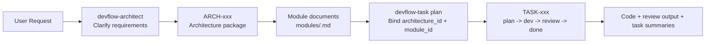
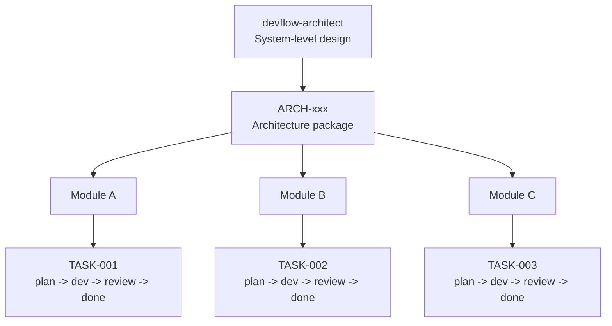
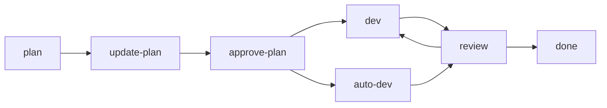

# DevFlow

DevFlow is a Codex plugin for complex engineering work.

It gives you two user-facing entrypoints:

- `devflow-architect`: turn a fuzzy request into executable architecture documents
- `devflow-task`: run implementation through an explicit `plan -> dev -> review -> done` workflow, with an optional `auto-dev` loop

The key idea is simple: architecture and implementation are separate, but compatible.

DevFlow is also a file-first workflow system.

Its plans, architecture documents, execution logs, review output, summaries, and shared context are all persisted as repository files under `DevFlowWorkspace/` instead of being treated as ephemeral chat state.



## What This Project Is

Use DevFlow when a task is large enough that you want:

- architecture clarification before coding
- explicit planning before implementation
- tracked progress across multiple iterations
- independent review before completion
- resumable task state in repository files
- reusable cross-task knowledge instead of rediscovering context

Why file-first matters:

- recovery is reliable: work can resume from files instead of relying on chat memory
- context usage is more efficient: agents can load `summary.md`, `global-summary.md`, task files, or architecture files on demand instead of depending on long chat history
- context quality is better: important decisions are compressed into reusable files, which reduces noise, context drift, and repeated rediscovery
- collaboration is clearer: humans and agents read the same artifacts
- review and audit are easier: plan, execution, and review history are all inspectable
- cross-task reuse is stronger: summaries and architecture packages can be consumed by later tasks
- workflow behavior is more deterministic: state lives in explicit files, not hidden runtime assumptions


DevFlow stores its working state in `DevFlowWorkspace/`, including:

- implementation tasks
- architecture packages
- global summaries
- review artifacts
- task-local summaries

## User Entry Points

| Entry | What it does | When to use it |
| --- | --- | --- |
| `devflow-architect` | Clarifies requirements through multi-round discussion and writes architecture docs under `DevFlowWorkspace/architectures/ARCH-xxx/` | The request is still vague, the system shape is unclear, or you want module-level design before coding |
| `devflow-task` | Runs tracked implementation work through `plan`, `update-plan`, `approve-plan`, `dev`, `auto-dev`, `review`, `done`, `resume` | You already know what to build, or you already have an architecture package and want to implement a module |

Internal skills exist, but they are not user entrypoints:

- `devflow-plan-internal`
- `devflow-dev-internal`
- `devflow-review-internal`

## How To Use

Before choosing a path, it helps to understand the layering:

- `devflow-architect` works at the system-design layer
- `devflow-task` works at the task-execution layer
- one architecture package may drive one or more implementation tasks
- each task runs the lower-level `plan -> dev -> review -> done` workflow, with an optional `auto-dev` execution mode after plan approval

`devflow-architect` is the upper layer. It defines the system, modules, data structures, constraints, and delivery order.
`devflow-task` is the lower layer. It takes one bounded implementation task and executes it through the tracked task workflow.



### Path 1: Architect First, Then Build

This is the recommended path for medium or large systems.

1. Use `devflow-architect` to clarify the problem and publish an architecture package.
2. Review the generated `ARCH-xxx` package.
3. Create one or more DevFlow tasks, each bound to one module:
   - `plan architecture_id=xxx module_id=xxx`
   - `architecture_id` and `module_id` are defined in ARCH-xxx/meta.json
4. Run the normal DevFlow lifecycle on each task:
   - `update-plan`
   - `approve-plan`
   - `dev`
   - optional `auto-dev`
   - `review`
   - `done`

Typical requests:

- "Use DevFlow Architect to design this system before implementation."
- "Use devflow-task plan for module `auth-service` in `ARCH-001`."
- "Approve the current DevFlow plan."
- "Use devflow-task dev to continue development on `TASK-003`."

### Path 2: Build Directly With DevFlow

Use this when the request is already implementation-ready.

1. Create a task with `devflow-task plan`
2. Iterate on the plan
3. Explicitly approve the plan
4. Implement
5. Review manually, or use `auto-dev` to keep looping `dev -> review` until review stops the loop
6. Finish with `done`

Typical requests:

- "Use devflow-task plan for this refactor."
- "Use devflow-task update-plan on the current task."
- "Use devflow-task review on the current task."
- "Resume the active task."

## Architect Workflow

`devflow-architect` is architecture-only. It does not enter the implementation task lifecycle.

Its workflow is:

1. Discovery
2. Outline confirmation
3. Publish architecture package

The generated architecture package lives under:

```text
DevFlowWorkspace/architectures/ARCH-xxx/
├── meta.json
├── request.md
├── outline.md
├── architecture.md
├── data-structures.md
├── constraints.md
├── development-plan.md
├── summary.md
└── modules/
    └── <module-id>.md
```

The main outputs are:

- `architecture.md`: high-level architecture
- `data-structures.md`: SQL DDL or JSON Schema, entity definitions, cache strategy
- `constraints.md`: stack, style, non-functional constraints
- `development-plan.md`: module order and dependencies
- `modules/<module-id>.md`: module-level executable design

Module granularity should match system complexity:

- simple systems should stay simple
- complex systems should be decomposed into clear modules
- do not over-fragment a small system
- do not under-design a large one

For example, a simple snake web game may reasonably produce only one module document.

## DevFlow Task Workflow

`devflow-task` supports these explicit actions:

- `plan`
- `update-plan`
- `approve-plan`
- `dev`
- `auto-dev`
- `review`
- `done`
- `resume`

Normal lifecycle:



Key rules:

- never skip planning
- never run `dev` before `approve-plan`
- never run `auto-dev` before `approve-plan`
- review does not modify code
- review pass means "ready to finish", not "already finished"
- only explicit `done` completes a task
- `auto-dev` is optional and independent from the manual path
- `auto-dev` stops on `pass` at `next_action=done`
- `auto-dev` stops on `blocked` and does not auto-retry

## How Architecture Connects To DevFlow

When you create a DevFlow task with `devflow-task plan`, you may bind it to:

- `architecture_id`
- `module_id`

That binding is stored in the task `meta.json` together with `architecture_path`.

When a task is bound, downstream development and architecture-sensitive review should read:

1. `architecture.md`
2. `data-structures.md`
3. `development-plan.md`
4. `constraints.md`
5. `modules/<module-id>.md`

This lets one architecture package drive multiple implementation tasks cleanly.

## Core Workspace Files

The workspace contains both implementation and architecture state:

```text
DevFlowWorkspace/
├── active-task.json
├── active-tasks.json
├── global-summary.json
├── global-summary.md
├── architectures/
│   └── ARCH-xxx/
└── tasks/
    └── TASK-xxx/
```

Implementation task shape:

```text
DevFlowWorkspace/tasks/TASK-xxx/
├── meta.json
├── request.md
├── plan.md
├── plan-history.md
├── dev.md
├── change-summary.md
├── review.md
└── summary.md
```

Important meanings:

- `active-tasks.json`: source of truth for unfinished task indexing and focus task
- `active-task.json`: compatibility projection for the focus task
- `global-summary.json` / `global-summary.md`: cross-task shared summary
- `tasks/TASK-xxx/meta.json`: source of truth for one task's stage state and optional `auto-dev` execution state
- `architectures/ARCH-xxx/meta.json`: source of truth for one architecture package
- `summary.md`: local handoff/recovery summary, not the primary state source

## Installation And Discovery

DevFlow is exposed through the personal marketplace:

- marketplace file: `~/.agents/plugins/marketplace.json`
- plugin source path: `plugins/devflow`

The plugin source lives in this repository, while Codex discovers it through that marketplace entry.

## Project Structure

```text
.
├── AGENTS.md
├── README.md
├── DevFlowWorkspace/
└── plugins/
    └── devflow/
        ├── .codex-plugin/plugin.json
        ├── assets/
        ├── scripts/
        └── skills/
```

Important paths:

- `plugins/devflow/.codex-plugin/plugin.json`: plugin manifest
- `plugins/devflow/skills/devflow-task/SKILL.md`: public implementation workflow entrypoint
- `plugins/devflow/skills/devflow-architect/SKILL.md`: public architecture workflow entrypoint
- `plugins/devflow/scripts/`: deterministic helpers for workspace/state operations
- `plugins/devflow/assets/console/index.html`: static console

## Current Boundary

Already implemented:

- plugin manifest
- public skills and internal skills
- task workspace protocol
- architecture workspace protocol
- per-task isolated worktree helpers
- task/global summary generators
- static console page

Not fully implemented yet:

- the main orchestrator that wires `Planner` and `Reviewer` to real `spawn_agent` and `resume_agent` calls
- full end-to-end automation of the entire lifecycle inside Codex runtime
- a first-class orchestrator loop for `devflow-architect`

At this stage, DevFlow is a strong workflow skeleton and file protocol, not yet a fully closed-loop orchestrator.

`auto-dev` now persists enough execution state for the public skill to resume an in-flight `dev -> review` loop without changing the core stage model.
